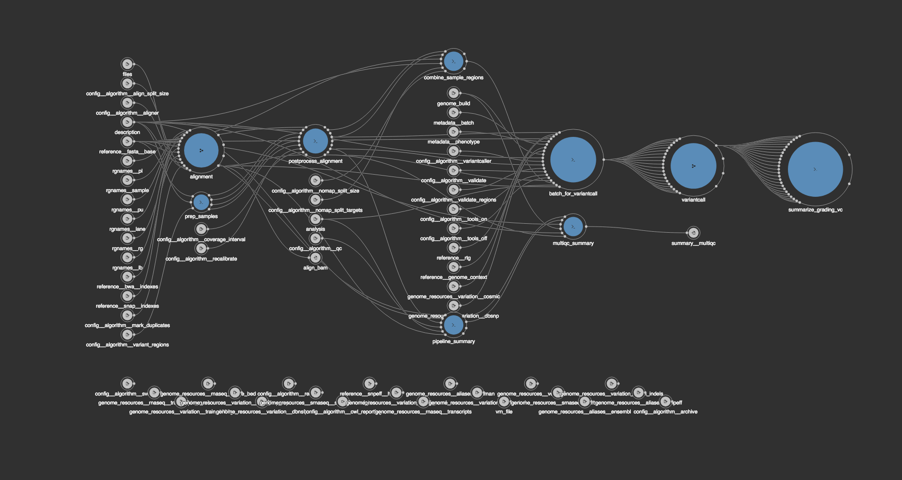
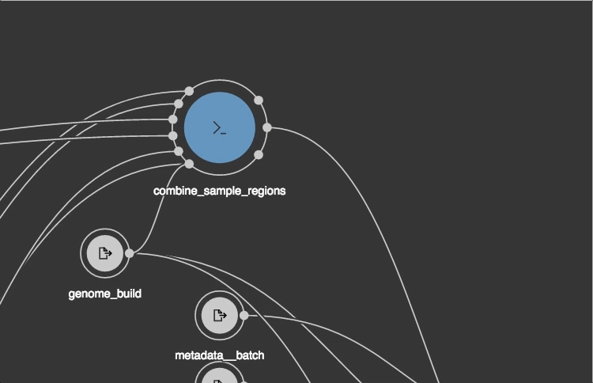
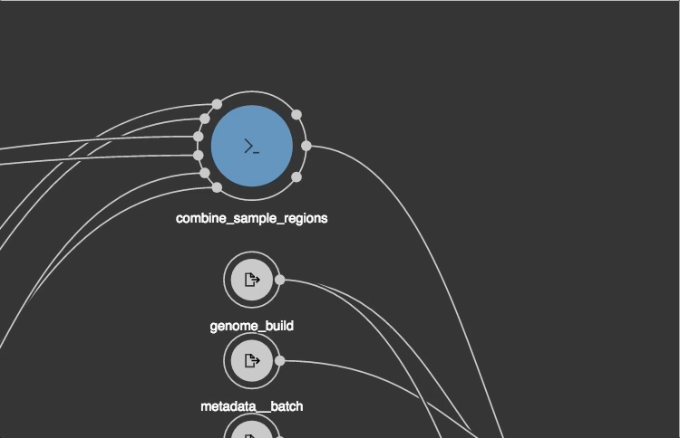

# CWL-SVG

CWL-SVG is a Typescript library for visualization of Common Workflow Language workflows
 
## Usage

```typescript
// If you need the bundled theme
import "./assets/styles/style.scss";

// Visualizer uses the data model from CWL-TS library, which is a dependency
import {WorkflowFactory} from "cwlts/models";

// Import the CWL-SVG workflow renderer 
import {Workflow} from "./graph/workflow";

const wf = WorkflowFactory.from({
    label: "Whole Genome Analysis",
    class: "Workflow",
    outputs: ...
    inputs: ...
    steps: ...
});

// We need an SVG dom element inside which we should draw the workflow
const svgRoot      = document.getElementById("svg") as SVGSVGElement;

// Draw
const workflow     = new Workflow(svgRoot, wf);

// You can scale the drawing to adjust it to fit the available viewport 
workflow.fitToViewport();

// You can also auto-arrange graph nodes spatially in case there's no information about node positions inside the CWL document
workflow.arrange();
```

## Todo
- Create a CLI interface for generating images from CWL files directly
- Compile a bundle usable without module loaders

## Preview

### Overview



### Selection


### Movement


### Connection

